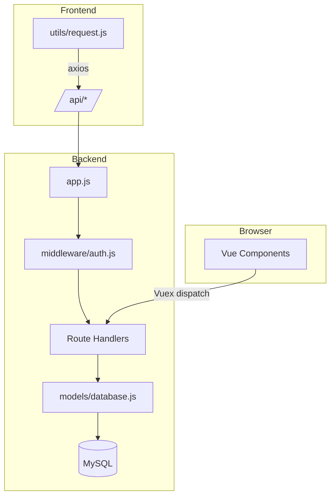

# 项目关键文件功能概览

> 本文列举军校学员个人生活助手中**最核心、最常用**的一批文件，说明它们「负责什么」「如何实现」，方便新成员快速上手。

---

## 一、后端（`/backend`）

| 文件/目录 | 作用 | 关键实现点 |
|-----------|------|------------|
| `app.js` | Express 入口。统一注册中间件、路由、404 和错误处理，并启动 HTTP 服务。 | • `cors` + `express.json()` 处理跨域和 JSON 解析 • `app.use('/api/xxx', require('./routes/xxx'))` 模块化路由 • `app.listen(PORT)` 前先 `require('./models/database')`，确保数据库就绪 |
| `models/database.js` | MySQL 连接与初始化。启动时自动**建库 / 建表 / 补列**并暴露查询封装。 | • `mysql2/promise` + 连接池 • `CREATE DATABASE IF NOT EXISTS` • 批量 `CREATE TABLE IF NOT EXISTS` • `SHOW COLUMNS` + `ALTER TABLE` 做增量升级 • 导出 `dbQuery / dbRun / dbGet` 简化 CRUD |
| `middleware/auth.js` | JWT 相关中间件。提供 `generateToken`、`authenticateToken`、`optionalAuth`。 | • `jwt.sign` 生成 7 天有效的 Token • `jwt.verify` 解码，同时查询数据库确认用户存在 • 将 `req.user / req.userId` 注入请求链 |
| `routes/` | 业务路由层，RESTful API。 | • `auth.js`：注册 / 登录 / 用户信息 • `tasks.js`：任务 CRUD，全部 SQL 加 `user_id` 条件隔离 • `finance.js`、`health.js`、`projects.js`：同理 |
| `middleware/` 其他 | 辅助中间件，如 `uploads`、自定义日志等（后续可扩展）。 | |

---

## 二、前端（`/src`）

| 文件/目录 | 作用 | 关键实现点 |
|-----------|------|------------|
| `main.js` | Vue 应用入口。挂载 `App.vue`、注册插件、全局过滤器。 | • `Vue.use(ElementUI)` • `Vue.prototype.$bus = new Vue()` 事件总线 • `new Vue({ router, store, render: h => h(App) }).$mount('#app')` |
| `router/index.js` | 前端路由配置和导航守卫。 | • 动态按模块拆分路由（`modules/*.js`） • 全局 `beforeEach`：检查 Token，若无重定向至 `/login` • `afterEach`：滚动至顶部、动态设置标题 |
| `store/index.js` | Vuex 根实例，整合模块。 | • `modules/user.js` 保存用户 Token / 信息 • `modules/task.js` 缓存任务列表，提供异步 actions 调后台 |
| `utils/request.js` | Axios 实例封装。统一 Token 注入、错误提示、业务状态码判断。 | • 请求拦截器：`config.headers.Authorization = 'Bearer ' + token` • 响应拦截器：401 → 跳转登录，错误 toast |
| `views/` | 页面级组件。 | • `dashboard/`：仪表盘与今日概览 • `finance/`：收支、预算、分析可视化 • `task/`：任务列表、进度、项目 |
| `components/` | 通用 UI 组件。 | 例如 `TodoList`、`Pagination`、`MarkdownEditor` 等，可复用于多页面 |
| `directive/` | 自定义指令集合，例如 `v-permission`、`v-waves`。 | |

---

## 三、通用/工具层

| 文件 | 作用与亮点 |
|-------|-----------|
| `plopfile.js` & `plop-templates/` | 代码生成器。一条命令快速生成页面 / 组件 / Vuex 模块骨架。 |
| `jest.config.js` + `tests/` | 单元测试配置和用例，覆盖工具函数 (`src/utils`) 及部分组件。 |
| `.env` (backend) | 后端运行时配置：端口、数据库、JWT 密钥、前端 URL 白名单。 |
| `postcss.config.js` & `styles/` | 全局 SCSS 变量、自动前缀等前端样式基础设施。 |

---

## 四、文件间数据流概览

> 用户操作组件 → Vuex Action → Axios 请求 → Express 路由 → 验证 Token → 执行业务 SQL → 返回 JSON → Vuex 更新状态 → 组件刷新 UI。

---

## 五、如何快速定位问题
1. **接口报错**：先看浏览器网络面板确认 URL → 找后端 `routes/xxx.js`。  
2. **401 未授权**：检查 `middleware/auth.js`、确认前端 `token` 是否存在 / 过期。  
3. **数据库字段缺失**：打开 `models/database.js` 的列补丁逻辑，确认是否走到 `ALTER TABLE`。  
4. **UI 不刷新**：组件派发的 Vuex Action 名称 → `store/modules/*.js` 对应 mutation 更新。  

---

> 以上即为项目中最重要文件的职责与实现要点。如需深入某模块，可再阅读对应源代码和测试用例。Happy Coding! 🎉 